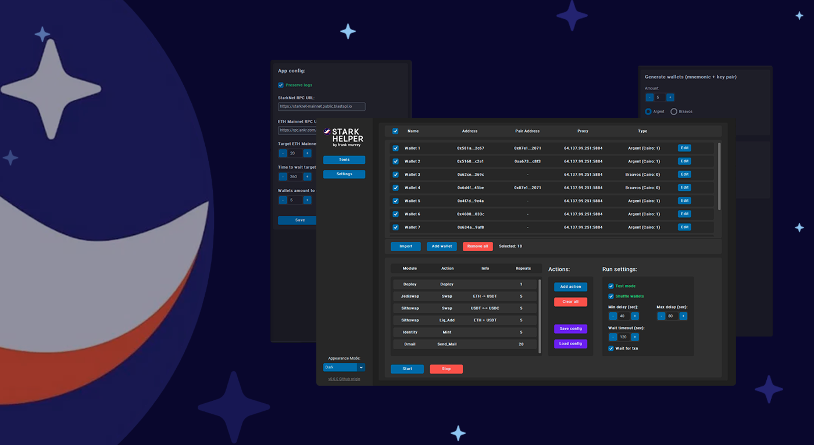

## StarkNet Helper

It's a python project with user-friendly interface, which allows you to interact with different StarkNet onchain projects and protocols using your multi amount of wallets.

| `run_gui.py` - to run the program

| `run_gui.py -ncr` - to run the program without req's checkup

## 📘 Documentaion

The **official** docs and guide info here:

**➡️ https://franky-murrey.gitbook.io/starknet-helper/**.

Developed in collab with [Kumushik](https://github.com/preposition17)

## Contacts and help

[Official Telegram channel](https://t.me/frank_murrey)

[Telegram chat](https://t.me/+e0uxgVUZPHo4Mzcy)

[Personal DM](https://t.me/frankmurrey)

## Support

**You brightened my day!**

EVM - `0xA7579FF5783e8bD48E5002a294A0b1054F820760`

Stark - `0x062d04705B96734eba8622667E9Bc8fec78C77e4c5878B2c72eA84702C17db3b`
